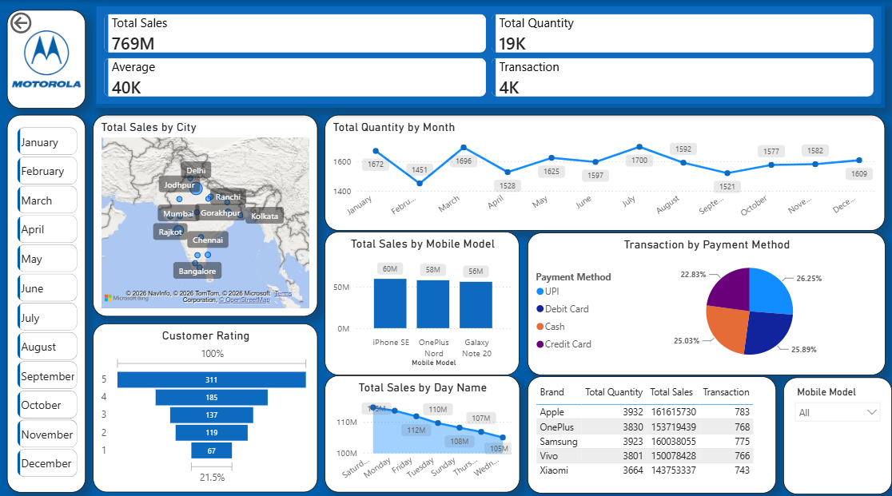

# 📱 Motorola Sales Analysis — Power BI

An interactive Power BI dashboard designed to analyze sales,
quantity, transactions, brands, mobile models, cities,
payment methods, customer ratings, and sales trends.

## 📊 Dashboard Preview

---

## 🎯 Business Objective

The objective of this project is to analyze sales performance
and identify actionable business insights.

---

## 📈 Key KPIs

| KPI | Value |
|---|---:|
| Total Sales | 769M |
| Total Quantity | 19K |
| Average Sales | 40K |
| Transactions | 4K |

---

## 🔍 Analysis Performed

### 🏙️ Sales by City

Analyzed sales performance across different cities to identify
high-performing geographic markets.

### 📅 Quantity by Month

Analyzed monthly quantity trends to identify changes in demand.

### 📱 Sales by Mobile Model

Compared sales across different mobile models.

### 💳 Transactions by Payment Method

Analyzed transactions using UPI, Debit Card, Cash, and Credit Card.

### ⭐ Customer Rating

Analyzed customer rating distribution to understand customer satisfaction.

### 📆 Sales by Day

Compared sales performance across different days of the week.

### 🏷️ Brand Performance

Compared brands based on total quantity, total sales, and transactions.

---

## 🛠️ Tools Used

- Microsoft Power BI
- Power Query
- DAX
- Data Cleaning
- Data Transformation
- Data Modeling
- Data Visualization
- Interactive Dashboard

---

## 💡 Key Business Insights

- Identified high-performing cities and markets.
- Compared sales performance across mobile models.
- Analyzed brand-level sales and quantity.
- Identified payment-method preferences.
- Analyzed monthly and day-wise trends.
- Evaluated customer rating distribution.

---

## 🎯 Business Recommendations

- Focus marketing efforts on high-performing cities.
- Optimize inventory for high-performing mobile models.
- Use monthly trends for inventory planning.
- Consider targeted offers based on payment preferences.
- Monitor customer ratings alongside sales performance.
- Develop separate strategies for different brands and models.

---

## 📁 Project Structure

Motorola-Sales-Analysis/
│
├── Dashboard/
│   └── Motorola_Dashboard.png
│
├── Data/
│   └── Motorola_Sales_Data.xlsx
│
├── PowerBI/
│   └── Motorola_Sales_Analysis.pbix
│
├── README.md
└── LICENSE

---

## 📥 Project Files

### 📊 Power BI Project

[Open Power BI File](PowerBI/Motorola_Sales_Analysis.pbix)

### 📁 Source Dataset

[View Source Dataset](Data/Motorola_Sales_Data.xlsx)

### 🖼️ Dashboard Image

[View Dashboard Image](Dashboard/Motorola_Dashboard.png)

---

## 👨‍💻 Skills Demonstrated

**Power BI | Power Query | DAX | Data Cleaning | Data Modeling | KPI Development | Data Visualization | Dashboard Development | Business Intelligence | Sales Analysis**
